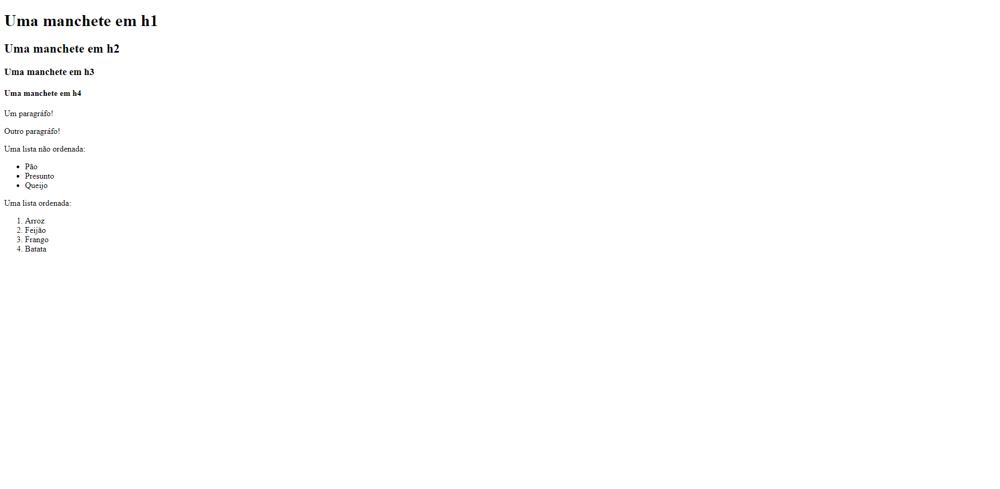

# pweb_2022.2_italoCosta

## Repositório da disciplina de Programação Web ministrada por [@pwebufersa](https://github.com/pwebufersa) no semestre 2022.2

Nesse Repositório ficarão disponíveis os exercícios da disciplina.

# Unidade 1

## Exercício 1

Veja [aqui](u1_exercicio1/).

### Demo

  

## Exercício 2

Veja [aqui](u1_exercicio2/).

## Exercício 3

Veja [aqui](u1_exercicio3/).

---

This project is under the [MIT license](./LICENSE).
